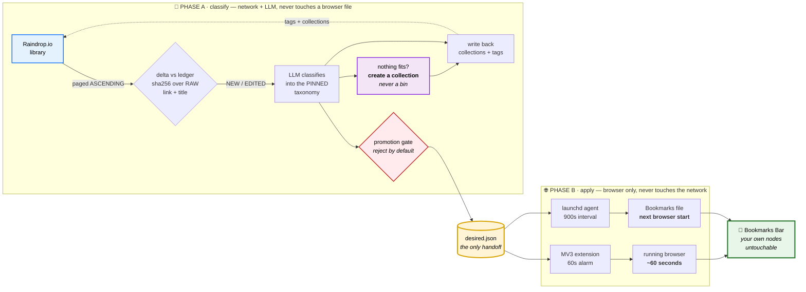

<h1 align="center">raindrop-brave-sync</h1>

<p align="center">
  <em>An LLM reads your bookmark library, works out what each save was actually about,<br>
  and files it — into Raindrop and into your browser bar.</em>
</p>

<p align="center">
  <a href="https://raindrop.io"></a>
  <a href="https://brave.com"></a>
  <a href="https://claude.com/claude-code"></a>
  <a href="https://www.anthropic.com"></a>
</p>

<p align="center">
  
  
  
  
  
  
</p>

<p align="center">
  <a href="LICENSE"></a>
  
  
  <a href="RESEARCH.md"></a>
</p>


<p align="center">
  <a href="#architecture">Architecture</a> ·
  <a href="SETUP.md">Setup</a> ·
  <a href="RESEARCH.md">Research</a> ·
  <a href="#design-principles">Principles</a> ·
  <a href="#status-and-limitations">Limitations</a>
</p>

---

> **If you only read one file, read [RESEARCH.md](RESEARCH.md).**
> Chromium hashes bookmark titles as UTF-16LE while every other field is UTF-8. Brave reads
> native-messaging manifests from *Chrome's* directory, not its own. Packing a `.crx`
> permanently poisons your extension id. None of this is documented anywhere else, and each
> one cost hours to find.

**An LLM reads your [Raindrop.io](https://raindrop.io) library, files every bookmark into a
pinned taxonomy, and mirrors the results into Brave's bookmarks bar.** Classification writes
collections and tags back to Raindrop and stages a small, heavily filtered set of promotions
for the browser. With the extension installed, a staged change lands in the running browser
within about a minute; without it, a launchd agent rewrites Brave's bookmarks file and the
change appears at the next Brave start.

It is deliberately additive. Nothing it runs will ever delete a bookmark you made. It *can* add
into a folder you curated — that is the point — but only nodes it created and marked as its own.
It will never move, rename or remove anything you put there yourself.

---

## Why this exists

Bookmark libraries decay. You save with intent — an article you meant to finish, a contractor
you meant to call, a standard you meant to read — and six months later it is an undifferentiated
pile of a few hundred links with no structure, which is the same as having none.

Syncing is the boring half. Anything can copy a list of URLs from one place to another. The
interesting half is *classification*: deciding what each save was actually about, and doing it
well enough that the result is worth looking at. That takes judgement, which is why there is an
LLM in the loop and no keyword rules.

And the second constraint is what makes it hard: a hand-curated bookmarks bar is itself a
valuable artifact. Most sync tools solve the ownership problem by dumping everything into one
quarantined folder. This one places items into your real folders, which is only safe if the
mechanism can prove which nodes are its own. That proof — a `meta_info` marker on every node it
creates, verified to survive Brave's own round-trip — is most of the engineering here.

---

## Architecture

Two phases, deliberately split. Phase A does network and LLM work and never touches a browser
file. Phase B touches the browser and never touches the network.



<details>
<summary><b>The same thing with every detail spelled out</b> — encodings, call sequence, failure handling</summary>

```
╔═══ PHASE A — classify ══════════════════ Claude Code skill, on demand ═══╗
║                                                                          ║
║   Raindrop.io                                                            ║
║       │  read (full library; export.csv or paged ASCENDING)              ║
║       ▼                                                                  ║
║   delta vs ledger ──── content_hash = sha256(raw_link|raw_title|||)      ║
║       │                NEW · EDITED · taxonomy_version bumped            ║
║       ▼                                                                  ║
║   LLM classifies ONLY the delta into the PINNED taxonomy                 ║
║       │            (nothing fits → create a collection, never a bin)     ║
║       ├──── write back ──▶ Raindrop: collections + tags (read-modify-    ║
║       │                    write; Raindrop's tag API appends)            ║
║       ▼                                                                  ║
║   promotion gate — reject by default, ~1–3 survivors a month             ║
║       │                                                                  ║
╚═══════╪══════════════════════════════════════════════════════════════════╝
        ▼
   ~/.raindrop-sync/desired.json      {raindrop_id, name, url, folder_path}
        │
╔═══════╪═══ PHASE B — apply ═══════════════════════ two independent paths ═╗
║       │                                                                  ║
║       ├─▶ PRIMARY: unpacked MV3 extension                                ║
║       │     alarm every 60s ──▶ spawns native_host.py (~30ms)            ║
║       │     host reads desired.json + ledger ──▶ "pending: N of M"       ║
║       │     extension calls chrome.bookmarks.create()                    ║
║       │     ▶ lands in the RUNNING browser, no file surgery, no race     ║
║       │                                                                  ║
║       └─▶ FALLBACK: launchd agent, StartInterval 900                     ║
║             apply_brave.py rewrites Brave's Bookmarks JSON directly      ║
║             backup → atomic replace → re-read → verify → retry next tick ║
║             ▶ certain to be visible at the next Brave start              ║
╚══════════════════════════════════════════════════════════════════════════╝
                                    │
                                    ▼
                        Brave  ▸  Bookmarks Bar
                        (unmarked nodes untouchable by construction)
```

</details>

Both appliers are safe to run together: each skips anything already present by URL, and neither
ever deletes. If the extension is disabled or Brave is closed, the file writer covers it. If the
file writer loses a race with Brave — Brave re-serializes its in-memory tree over the file a
couple of seconds after any bookmark change — the only casualty is *our* pending addition, which
the next tick re-applies. Your bookmarks live in Brave's authoritative in-memory model and are
never at risk from a concurrent write.

### Where state lives

Everything is local, under `~/.raindrop-sync/` (mode `0700`):

| Path | Holds |
|---|---|
| `state.db` | SQLite ledger — one row per bookmark, per-browser applied ledger, run history |
| `taxonomy.json` | **the pinned taxonomy** — generated once from your own library |
| `collection-map.json` | taxonomy path → Raindrop collection id |
| `desired.json` | staged browser promotions, the only handoff from Phase A to Phase B |
| `backups/` | timestamped copies of Brave's `Bookmarks` *and* `Bookmarks.bak`, keep 10 |
| `log/` | applier and native-host logs |
| `key.pem` | the extension signing key — pins the extension id, do not lose it |

Nothing leaves your machine except calls to the Raindrop API and whatever your Claude Code
session sends to the model.

---

## Requirements

- **macOS.** Verified on macOS 26 with Brave 152. Nothing here is portable to Windows or Linux
  as written (launchd, macOS keychain, macOS profile paths).
- **Brave.** Other Chromium browsers use the same bookmarks format and the same
  `chrome.bookmarks` API and *should* work; untested.
- **Python 3, standard library only.** The system `/usr/bin/python3` is the recommended
  interpreter — no venv, no pip, and immune to a `brew upgrade` moving a symlink.
- **A Raindrop.io account and an API token.** The free plan is sufficient; the Pro-only
  `/raindrop/{id}/suggest` endpoint is deliberately not used.
- **Claude Code, with a Raindrop connector, for Phase A.**

**Be clear about that last one: Phase A needs an LLM and has no fallback.** There is no
keyword-rules mode, no local-model mode, no "classify by domain" mode. If you are not willing to
run a model over your bookmark titles and URLs, this project has nothing to offer you. Phase B —
the browser side — is plain stdlib Python and runs perfectly well on a `desired.json` you wrote
by hand, if that is the half you came for.

---

## Quickstart

```bash
git clone <this repo> && cd raindrop-brave-sync
./scripts/bootstrap.sh
```

That creates `~/.raindrop-sync/`, generates your extension signing key and id, installs the
native-messaging host manifest, and installs the launchd fallback agent. Then follow
**[SETUP.md](./SETUP.md)** for the parts that cannot be automated: the Raindrop token, the
one-time **Load unpacked** of the extension, and the first full classification run that
generates *your* taxonomy.

Read **[SETUP.md](./SETUP.md)** before running anything against a library you care about.

---

## Design principles

### 1. Nothing is noise. There is no bin.

This is the one that matters, and the reason the classifier is an LLM.

A bookmark library is a record of deliberate acts. Somebody stopped what they were doing,
decided a page was worth keeping, and saved it. A classifier that shrugs at things it does not
recognise and sweeps them into "Misc" is not tidying up — it is destroying the signal it was
built to find. **When nothing in the taxonomy fits, the correct outcome is to create a new
category, not to reach for a catch-all.** `Noise`, `Junk`, `Misc`, `Other`, `Various`,
`Uncategorised` are forbidden collection names, along with any catch-all wearing a nicer one.

The tempting shortcut is a mechanical rule: *this URL carries an ad click-id, therefore it is
junk.* That rule is wrong, and it is wrong in an instructive way. `utm_source=…`, a tracking
parameter, a `share.google` shortlink — every one of those describes **how a bookmark arrived**.
None of them says anything about **whether it matters**. If somebody tapped an advertisement for
a plumber and then deliberately saved it, what that record means is *they were looking
for a plumber* — which is exactly the kind of thing a bookmark library exists to
remember. Provenance is real and worth recording as a tag; it must never drive placement.

The same reasoning covers dead links and unreadable slug titles. Those are research problems —
follow the redirect, check the Wayback Machine, work out what the page was — not grounds for
binning. And design for the library's next 500 saves rather than for a tree that looks tidy
today: real interests sprawl.

### 2. Pin the taxonomy.

The routine pass **never re-derives the folder tree**. It classifies new items into the existing
taxonomy, passed into the prompt. Re-derivation is a separate, explicit, user-invoked operation
that bumps `taxonomy_version` and reclassifies everything.

Without this rule the same bookmarks get regrouped under slightly different names on every run,
and the bar is permanently unstable *even when every individual write is correct*. Extending the
tree with a new collection (see principle 1) is allowed and expected. Restructuring existing
collections is not.

The same instinct governs change detection: the delta is computed from a content hash over the
**raw** Raindrop values, never from a timestamp. Raindrop bumps `lastUpdate` on every write
including our own, so a timestamp watermark re-selects the entire library forever.

### 3. Reject by default at the browser boundary.

Raindrop is a library; the bookmarks bar is a curated shortlist someone built by hand. Those
deserve different standards, so the promotion gate is adversarial: deep links that will rot,
commentary about a field rather than a primary source, one-off saves of early-stage products,
job postings and news articles, and any proposed new folder holding fewer than three qualifying
items are all rejected. On the first real run, eight promotions were proposed and seven were
rejected.

A rejected item stays in Raindrop and loses nothing. A wrongly promoted one quietly degrades a
bar somebody spent years building. The asymmetry is the whole argument.

### 4. Never delete.

Deletion propagation is off by default, and both appliers are additive-only. A bookmark that has
been trashed in Raindrop, or missed by a paging race, looks *exactly* like a hard delete from the
outside — and getting that wrong costs the user data that this tool cannot restore.

### 5. Own nodes by marker, not by folder or position.

Every node the file writer creates carries `meta_info: {"raindrop_sync": "v1"}`, and it may only
add or remove marked nodes. Unmarked nodes — everything you curated — are untouchable by
construction, which is what makes it safe to file into your real folders instead of a quarantine
folder. Marked nodes are located by a full-tree walk on the marker, never by position: positional
lookup silently duplicates the moment you drag a folder.

### 6. Abort rather than guess.

The file writer refuses to run if Brave Sync is enabled, if the bookmarks file is missing while
the profile is populated, if the format version is unexpected, or if the file's own checksum does
not match — anything that suggests something else is editing. It backs up both `Bookmarks` and
`Bookmarks.bak`, reopens the backup to confirm it parses, writes atomically, then re-reads from
disk and verifies before declaring success. A malformed bookmarks file makes Brave behave like a
fresh profile with no dialog and no error, and Chromium has no restore-from-backup anywhere.

---

## Deliberately not included

- **No Safari support.** Not "not yet" — *not possible*. Every route was tested and closed:
  extension APIs compiled out, AppleScript terminology that will not compile, no Shortcuts
  action, no URL scheme, no `safaridriver` endpoint, an MDM-only declarative path, and direct
  plist writes guarded against an iCloud store that fans out to every Apple device. The evidence
  is in [RESEARCH.md](./RESEARCH.md).
- **No cloud component.** No server, no hosted service, no account. State is files in your home
  directory.
- **No telemetry.** Nothing phones home. The only outbound traffic is the Raindrop API.
- **No bundled taxonomy.** Yours is generated from your own library on the first run. A shipped
  taxonomy would be somebody else's interests imposed on your bookmarks — precisely the failure
  mode principle 1 exists to prevent.
- **No packed CRX, no store listing.** The extension is loaded unpacked, on purpose. A locally
  signed CRX installs and is then permanently disabled by Chromium's install verifier, and the
  extension id is poisoned for good. See [RESEARCH.md](./RESEARCH.md) before you try it anyway.

---

## Status and limitations

Built and running since 2026-09-05. Honest accounting:

- **macOS only.** launchd, keychain, macOS profile paths.
- **Brave-focused.** Chromium-family browsers should work; untested.
- **Phase A requires an interactive Claude Code session.** The classification pass is invoked on
  demand rather than on a schedule, because the Raindrop connector it reads through is not
  available to a headless run. The design allows for a daily scheduled fetch agent, and Phase B
  already runs unattended — but as built, classification is something you start.
- **The extension must be loaded unpacked, by hand, once.** `--load-extension` only applies to a
  browser you launch yourself. Your extension id is generated from your own `key.pem` and looks
  like `abcdefghijklmnopabcdefghijklmnop`; it will not match anyone else's, and losing `key.pem`
  means a new id and an update to the native-host allowlist.
- **Writes can lose a race with a running Brave.** By design, the applier writes anyway and
  re-verifies on the next tick. It converges the moment Brave has a quiet tick, and always
  survives once Brave restarts and reads the file.
- **`meta_info` marker survival should be re-verified after major Brave upgrades.** It passed
  7/7 on Brave 152; marker-based ownership depends on it.
- **Raindrop's `changedBookmarksDate` gate is untested**, so Phase A currently does a full read
  every run rather than trusting a cheap "nothing changed" exit.
- **Deletion propagation is not implemented** and is not on the roadmap in any form that runs
  without confirmation.

### What was actually verified

Against a copy of a real profile, then against real Brave: an externally authored bookmarks file
loads byte-identically with no recovery pass; emoji, astral-plane, CJK and Devanagari titles
round-trip intact through both writers; the `meta_info` marker survives Brave's own
re-serialization; and an independent implementation of Brave's bookmarks checksum reproduces the
file Brave itself wrote. [RESEARCH.md](./RESEARCH.md) records what was tested, how, and what remains
untested — it is the authoritative source for every claim above.

---

## Read the research

**[RESEARCH.md](./RESEARCH.md)** is the reason many people will end up here. It is the record of
what had to be discovered by experiment because no documentation says it, including:

- **Brave's bookmarks checksum hashes titles as UTF-16LE and everything else as UTF-8.** That one
  detail was the entire puzzle.
- **Brave reads native-messaging host manifests from *Chrome's* directory**, not its own. A
  manifest in Brave's own `NativeMessagingHosts/` is silently ignored. This cost four failed test
  rounds and is diagnosable only from Brave's own stderr log.
- **Safari is a hard no**, seven independent ways, each one refuted rather than assumed.
- **A locally signed CRX is a trap.** It installs, then is disabled as unverified, and the
  extension id can never be re-enabled — including by re-loading the same folder unpacked.
- **Hashing curated values instead of raw ones re-flags a third of your library forever** — the
  same failure the timestamp watermark was rejected for, reached by a different route.

---

## Contributing

Issues and pull requests are welcome. Two requests before you open one:

1. **Read [RESEARCH.md](./RESEARCH.md) first.** Nearly every rule that looks arbitrary is there
   because a specific failure mode was found by testing, and the reasoning is written down. If a
   change contradicts a documented invariant, say which one and why the reasoning no longer
   holds.
2. **Test against a copy, never the live file.** Point `RAINDROP_SYNC_PROFILE` and
   `RAINDROP_SYNC_ROOT` at throwaway directories with a copied `Bookmarks` file. A bug that built
   a duplicate folder tree beside real folders was caught exactly this way.

Never include real bookmarks, tokens, collection ids, extension ids, or absolute paths
containing a username in an issue or a patch.

## Licence

MIT — see [LICENSE](./LICENSE).
